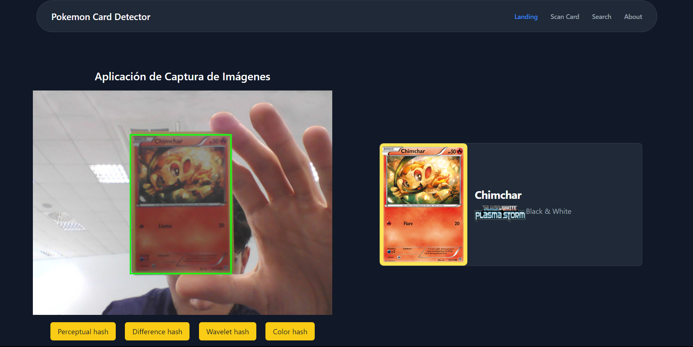

# Pokemon TCG Card detector using OpenCV



## Description

This project is a Pokemon TCG card detector using OpenCV. It is based on the Pokemon TCG API. The goal is to detect the card and then use the API to get the card information.

I used imagehash to compare the card image with the images from the API. I used the perceptual hash, difference hash and wavelet hash algorithms. I also used the OpenCV library to detect the card in the image.

There is a web interface to use the program. It is made with Flask. You just have to start the backend and open the web page to start scanning cards.

## Installation

Run the following command to install the required packages:

```bash
python -m venv venv
source venv/bin/activate # linux or macos
venv\Scripts\activate # windows
pip install -r requirements.txt
```

## Usage

Run the following command to start the program:

```bash
python backend.py
```
